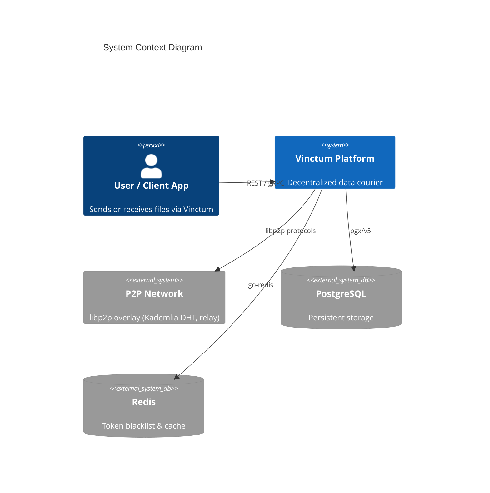
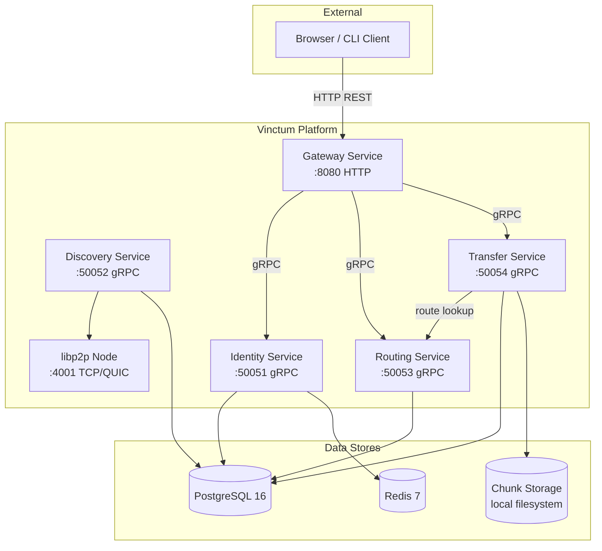
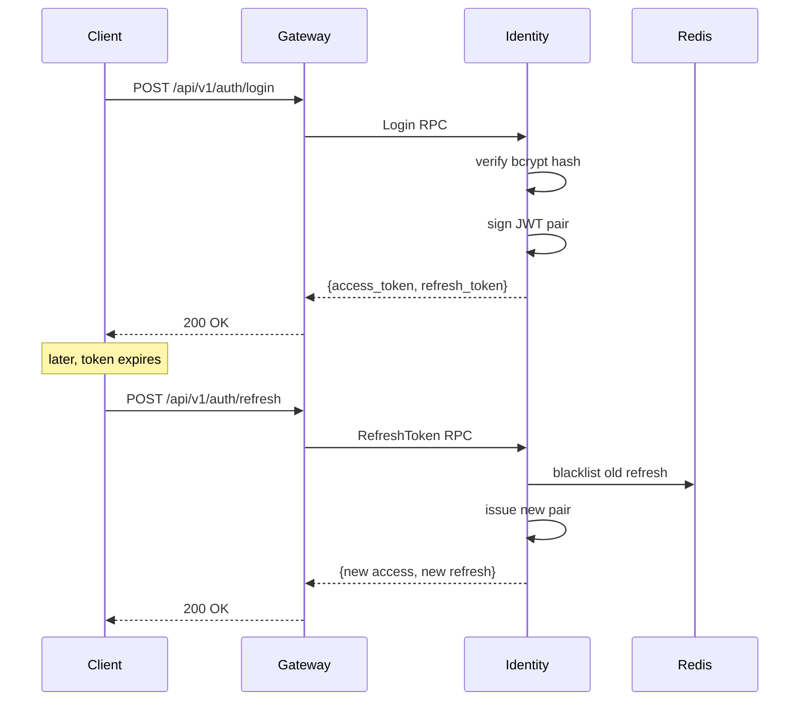
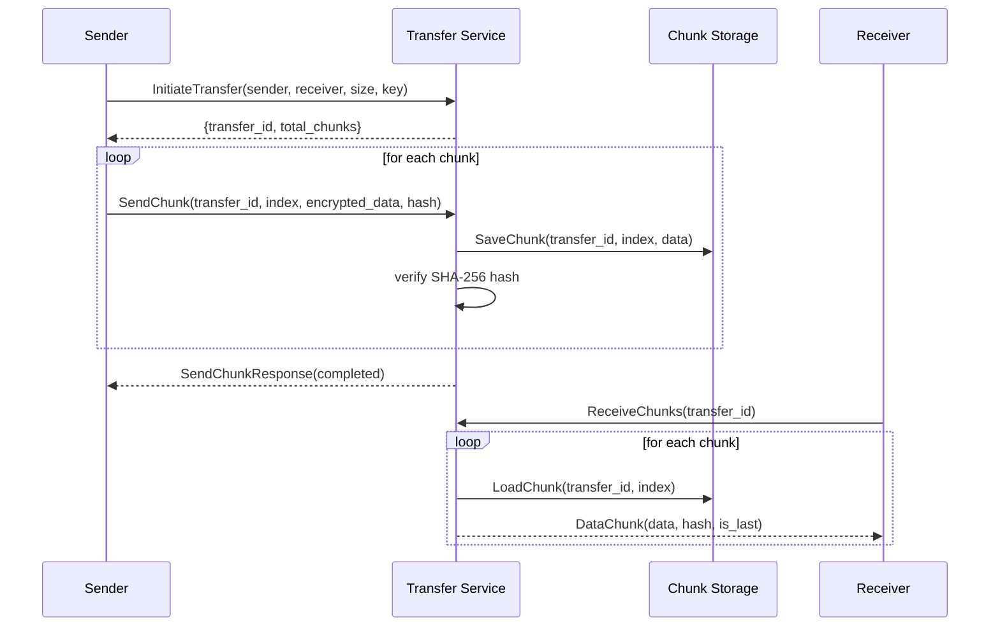
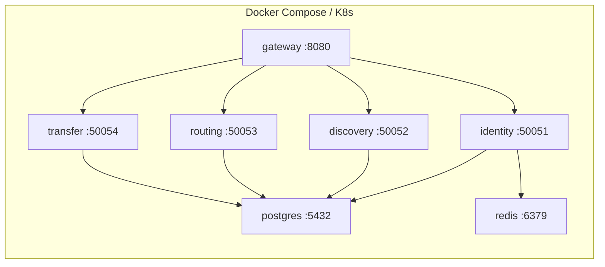

# Vinctum Architecture Document

## 1. Overview

Vinctum is a decentralized data courier platform that transports data securely across a peer-to-peer network. It replaces centralized cloud relay with a distributed mesh of nodes that discover each other, negotiate routes, and transfer encrypted chunks without a single point of failure.

The system is built as five loosely-coupled Go microservices communicating over gRPC, fronted by an HTTP gateway for browser clients.

## 2. System Context

## 3. Container Diagram

## 4. Service Responsibilities

### 4.1 Identity Service (port 50051)

Handles user registration, authentication, and token lifecycle.

- Register: username + email + password -> bcrypt hash -> DB -> user ID
- Login: credentials -> JWT access + refresh token pair
- ValidateToken: verify signature + expiry + blacklist check
- RefreshToken: issue new token pair with rotation (old refresh blacklisted)
- Logout: blacklist refresh token in Redis

**Auth flow:**

### 4.2 Discovery Service (port 50052)

Manages the peer registry. Nodes announce themselves; clients query for available peers.

- AnnounceNode: upsert peer info (node_id, multiaddrs, public_key, is_relay)
- FindPeers: list peers from DB registry
- GetNodeInfo: single peer lookup
- StreamPeerUpdates: server-streaming polling for peer changes

Backed by a libp2p node that participates in the Kademlia DHT for decentralized peer discovery alongside the centralized registry.

### 4.3 Routing Service (port 50053)

Computes optimal paths between nodes and maintains relay availability.

- FindRoute: walk the route table hop-by-hop from source to target
- UpdateRouteTable: upsert route entries (next_hop, metric, latency)
- GetRouteTable: return all entries for a given node
- ListRelays / RegisterRelay: manage relay node pool with circuit capacity tracking

### 4.4 Transfer Service (port 50054)

Orchestrates chunk-based file transfers with integrity verification.

- InitiateTransfer: create session, calculate chunk count, optionally resolve route
- SendChunk (client streaming): receive encrypted chunks, persist to FileStore, verify SHA-256 hash
- ReceiveChunks (server streaming): stream stored chunks to receiver
- CancelTransfer: update status + clean up stored chunks

**Transfer flow:**

### 4.5 Gateway Service (port 8080)

HTTP-to-gRPC reverse proxy for browser clients that cannot speak gRPC natively.

- Translates REST endpoints to gRPC calls
- Forwards Authorization header as gRPC metadata
- CORS middleware for cross-origin browser requests
- Health and service-status endpoints

## 5. Cross-Cutting Concerns

### 5.1 Authentication & Authorization

All gRPC services (except public methods on Identity) require a valid JWT in the `authorization` metadata. Interceptors in `pkg/middleware` validate the token and inject `user_id` and `email` into the request context.

**Public methods (no auth required):**
- `identity.v1.IdentityService/Register`
- `identity.v1.IdentityService/Login`
- `identity.v1.IdentityService/RefreshToken`

### 5.2 Database Migrations

SQL schemas in `scripts/migrations/` are embedded into the binary via `embed.go`. Each service runs `migrator.Run()` on startup, applying pending migrations idempotently from the `schema_migrations` tracking table.

### 5.3 Configuration

Viper-based config with three layers (highest precedence first):
1. Environment variables (`VINCTUM_` prefix, `_` as separator)
2. YAML config file (`config/config.yaml` or path override)
3. Hardcoded defaults in `setDefaults()`

### 5.4 Logging

Structured JSON logging via zerolog. Each log entry includes service name, version, and timestamp. Pretty console output in development mode.

### 5.5 Code Generation

- **Protobuf**: `buf generate` produces Go stubs and gRPC server/client interfaces
- **SQL**: `sqlc generate` produces type-safe query functions and a `Querier` interface per service

## 6. Deployment Topology

Each service has its own multi-stage Dockerfile (golang:1.23-alpine build -> alpine:3.19 runtime). Docker Compose orchestrates the full stack with health checks on Postgres and Redis.

## 7. Security Model

See `doc/threat_model.md` for the full STRIDE analysis.

Key controls:
- JWT (HMAC-SHA256) with token blacklist
- bcrypt password hashing (cost 12)
- Parameterized SQL queries via sqlc (no SQL injection)
- gRPC auth interceptors with method-level bypass
- E2E encryption for data chunks (AES-256-GCM)
- SHA-256 chunk integrity verification

## 8. Technology Decisions

| Decision | Choice | Rationale |
|----------|--------|-----------|
| Language | Go | High performance, native concurrency, strong gRPC ecosystem |
| Inter-service comm | gRPC + Protobuf | Strongly-typed, efficient binary serialization, streaming support |
| P2P networking | libp2p | Battle-tested (IPFS), built-in DHT, relay, NAT traversal |
| Database | PostgreSQL | ACID, mature, jsonb support for flexible schemas |
| Cache | Redis | Sub-ms latency for token blacklist checks |
| SQL layer | sqlc | Type-safe, no ORM overhead, generates Querier interface for testing |
| Config | Viper | YAML + env overlay, widely adopted in Go ecosystem |
| Auth | JWT + bcrypt | Stateless verification, industry standard |
| CI/CD | GitHub Actions | Native GitHub integration, matrix builds |
| Containerization | Docker + Compose | Standard for microservice dev/deploy |
